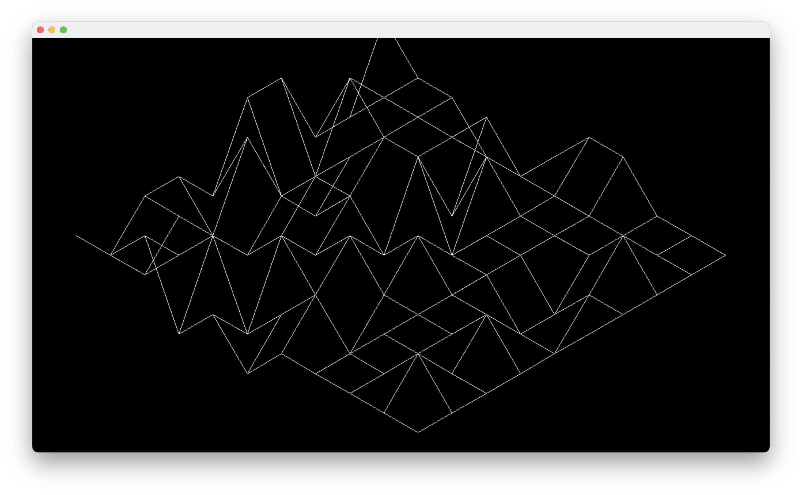
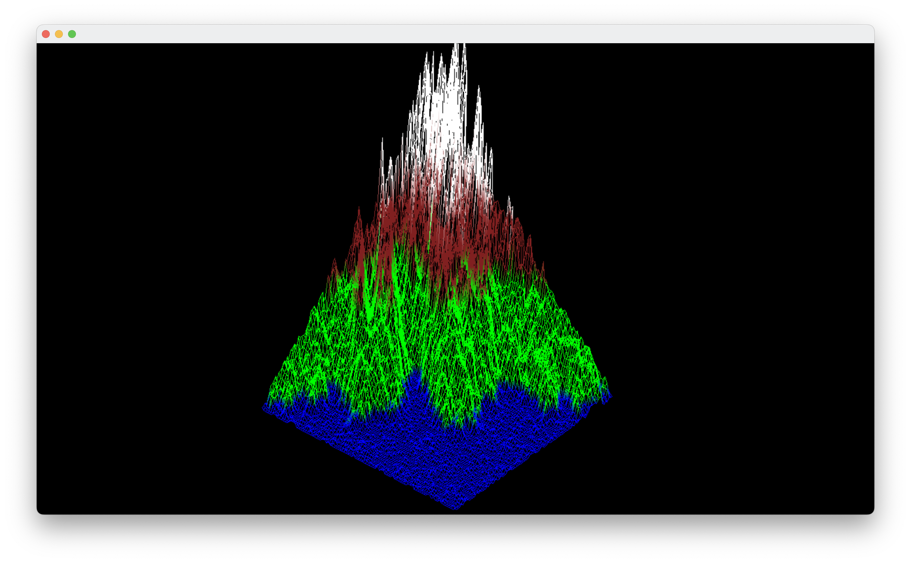

FdF: Wireframe Map Renderer
===========================

FdF is the first graphic project at 42. The goal is to create a wireframe representation of a map given as an argument.

The map is a 2D grid that represents the elevation of each point. The x and y coordinates correspond to the row and column numbers. Each point can also have an associated hexadecimal color. By applying an isometric projection to the vertices and connecting them with lines, the desired visual representation is achieved.  
To get more information about the subject please refer to [Subject.pdf](Subject.pdf)

To view the code that I pushed to the school repository, please refer to the `42-Repo` branch.

Support
------

| Platform | Supported | Used Graphic API |
|----------|-----------|------------------|
| Windows  | YES       | OpenGL           |
| Linux    | YES       | OpenGL           |
| MacOS    | YES       | Metal or OpenGL  |

Build
-----

The repository must be cloned instead of downloading it as a zip file in order to resolve the submodules when configuring the project with CMake. Recursive cloning is not required as everything is managed through CMake.

The project can be built using CMake.

```sh
mkdir build
cmake -S . -B build
cmake --build build
```

Building in release mode can provide better performance.

```sh
mkdir build
cmake -S . -B build -DCMAKE_BUILD_TYPE=Release
cmake --build build
```

| CMake Options     | Values   | Description                                            |
|-------------------|----------|--------------------------------------------------------|
| `FDF_FORCE_OPENGL`| ON / OFF | Use OpenGL even if metal is available (only for MacOS) |

Usage
-----

Run the program with the desired map as the first argument.

```sh
./build/FdF maps/10-2.fdf
```

Keys:

- `ESC`: Exit the program
- `1` and `2`: Switch between top view and isometric projection
- `R`: Activate/Deactivate auto rotation
- `Arrows`: Move the map
- `Mouse`: Rotate the map
- `Mouse wheel`: Zoom

Examples
--------

10-2


t2


Libraries
---------

FdF uses one library called MiniLibX, provided by 42. It allows for basic keyboard and mouse input, opening windows, and simple drawing capabilities.  
To draw inside the window, MiniLibX provides a way to create pixel buffers. The user can then set pixel colors inside the buffers and draw the buffers on the window.  
In my case i use a single buffer that i draw every frame on the window, which allows me to manipulate each pixel of the window individually.

This branch uses my own implementation of MiniLibX in order to compile for Windows, Linux, and macOS.

- [Original MiniLibX for Linux](https://github.com/42Paris/minilibx-linux)
- [My cross-platform implementation of MiniLibX](https://github.com/Thomas-Chqt/MinilibX)

Learning
--------

FdF was an excellent introduction to computer graphics, providing hands-on experience with matrix multiplication for 3D transformations and projections.  
Through the implementation of graphics at the pixel level, I gained a deep understanding of fundamental concepts like Bresenham's line algorithm.

One of the main challenges I encountered was understanding the application of matrices for 3D transformations and effectively using them to rotate and move my mesh. This required a solid understanding of linear algebra and its practical implementation in computer graphics.

Overall, FdF served as a valuable learning experience, allowing me to develop essential skills in computer graphics and deepen my understanding of 3D transformations.

References
----------

The most useful resource that I used to complete this project was the "Code-It-Yourself! 3D Graphics Engine" YouTube video series by javidx9, particularly the first episode [Code-It-Yourself! 3D Graphics Engine Part #1 - Triangles & Projection](https://www.youtube.com/watch?v=ih20l3pJoeU).
